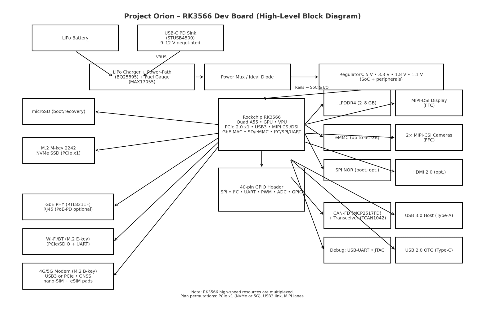

# Project Orion – RK3566 Development Board

A powerful, compact, and user-friendly development board built from scratch around the **Rockchip RK3566** SoC. Designed for both **hobbyists** and **professionals**, Orion balances performance, connectivity, and expandability while keeping costs accessible. The board runs **Linux (Armbian/Ubuntu/Debian)** and supports a wide ecosystem of peripherals.

---

**About the creator**  
I am 19 years old and just starting university as an **Electronics Engineering** student. With some prior experience in hobby electronics and PCB design, I’m using Project Orion to dive deep into **high-speed interfaces (DDR, PCIe, USB 3.0, MIPI)**, **6-layer PCB routing**, **USB-C Power Delivery**, and **Linux bring-up**. This project is both a functional SBC and a learning journey.

---

## ✨ Key Features
- **SoC:** Rockchip RK3566 (Quad Cortex-A55, Mali-G52 GPU, VPU, NPU-lite)
- **Memory:** Up to 8 GB LPDDR4 RAM
- **Storage:**
  - Onboard eMMC (up to 64 GB)
  - microSD card slot (boot or expansion)
  - Optional NVMe SSD via M.2 (2242, PCIe 2.0 x1)
- **Connectivity:**
  - Gigabit Ethernet (RJ45, optional PoE-PD)
  - Wi-Fi 5/6 via M.2 E-key
  - 4G/5G modem support via M.2 B-key (Quectel EG25-G, RM502Q, etc.)
  - Integrated GNSS/GPS (through cellular module)
- **I/O:**
  - 40-pin GPIO header (Pi-compatible pinout)
  - Interfaces: SPI, I²C, UART, PWM, ADC, GPIO
  - CAN-FD (MCP2517FD + TCAN1042)
- **Display & Camera:**
  - 1× MIPI-DSI (up to 4 lanes)
  - 2× MIPI-CSI (camera input)
  - Optional HDMI 2.0 output
- **USB & Expansion:**
  - USB-C with Power Delivery (data + power)
  - USB 3.0 Host
  - USB 2.0 OTG
  - Dual M.2 slots (B-key for cellular, E-key for Wi-Fi/BT, M-key for NVMe SSD)
- **Power:**
  - USB-C PD input (STUSB4500 controller)
  - Single-cell LiPo battery support (BQ25895 charger + power-path)
  - Fuel gauge (MAX17055)
  - Safe power sequencing for SoC + peripherals
- **Form Factor:**
  - Compact ~85 × 60 mm PCB
  - 6-layer design with impedance-controlled high-speed routing

---

## 🛠 Project Goals
- Create a **Linux-capable SBC** with modern connectivity in a compact size.
- Offer **plug-and-play usability** for hobbyists while providing **pro-grade interfaces** for industrial/prototyping use.
- Keep **costs as low as possible** without sacrificing usability.
- Provide **full open hardware documentation** (schematics, PCB files, BOM, reference images).
- Showcase a **learning journey** in:
  - High-speed PCB design (DDR, PCIe, USB 3.0, MIPI)
  - Power management and USB-C PD integration
  - Linux bring-up (U-Boot, kernel config, device tree)
  - Modular design for multiple use cases (IoT, robotics, edge AI, prototyping)

---

## 📂 Repository Structure

/docs            → Block diagrams, design notes, datasheets
/hardware        → KiCad schematics, PCB layout, Gerbers
/firmware        → Bootloader (U-Boot), Device Tree, kernel patches
/software        → Rootfs setup, build scripts, test utilities
/cad             → Mechanical drawings, 3D STEP models
/production      → BOM, assembly files, test plans

---

## 🖼 Block Diagram

---

## 🚀 Getting Started (Future)
1. Flash the provided Armbian/Ubuntu image to microSD or eMMC.
2. Connect display (HDMI/MIPI), keyboard, and power via USB-C.
3. Boot into Linux and expand storage if needed.
4. Optional: Insert M.2 Wi-Fi or cellular module and configure via `NetworkManager`.

---

## 📡 Roadmap
- [ ] Finalize block diagram & power tree
- [ ] Complete schematic capture in KiCad
- [ ] DDR routing + 6-layer PCB layout
- [ ] Prototype manufacturing + bring-up
- [ ] Linux boot (U-Boot + Armbian)
- [ ] Validate peripherals (Ethernet, Wi-Fi, LTE/5G, GPIO, CAN, CSI/DSI)
- [ ] Release open-source hardware files

---

## ⚖ License
- Hardware: **CERN OHL-S** (Open Hardware License, Strongly Reciprocal)
- Software: **GPLv3** / **Apache 2.0** depending on component

---

## 🤝 Contributing
Contributions are welcome!
- Suggest features
- Help test Linux builds
- Improve schematics or PCB layout
- Share use cases and demos

---

## 📢 Status
🚧 **Work in Progress** – This repo documents the journey of designing and building a complete SBC from scratch.

Follow along and contribute as we bring **Project Orion** to life ✨
